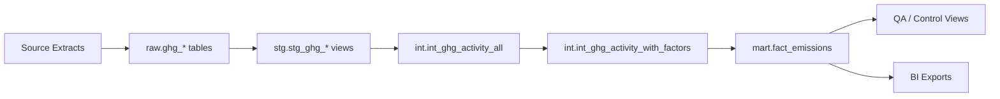

# Model Lineage Diagram — GHG Scope Reporting

```mermaid
flowchart LR
    A[Source Extracts] --> B[raw.ghg_* tables]
    B --> C[stg.stg_ghg_* views]
    C --> D[int.int_ghg_activity_all]
    D --> E[int.int_ghg_activity_with_factors]
    E --> F[mart.fact_emissions]
    F --> G[QA / Control Views]
    F --> H[BI Exports]
```
